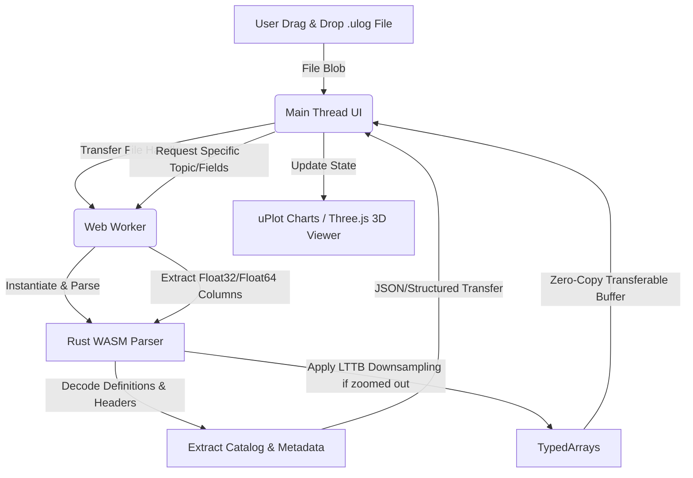

# 軟體需求規格書 (SRS)

## 專案名稱：純前端網頁版 PX4 ULog 線上分析與動態儀表板

---

## 1. 專案概述與目標 (Project Overview)

### 1.1 核心背景

PX4 飛行控制系統產生的 `.ulog` 檔案為二進位格式，且資料量龐大（單次飛行可達數十至數百 MB，包含數百萬個高頻感測器點位）。現存的官方工具（如 Flight Review）需要架設後端伺服器與資料庫，對於使用者隱私與部署成本皆是負擔。

### 1.2 專案目標

本專案旨在開發一個完全基於瀏覽器前端（Client-side）的單頁應用程式（SPA）。所有檔案解析、數據處理、圖表繪製、3D 動態回放皆在使用者本地瀏覽器完成，無任何後端伺服器（Zero-Backend）。

* **部署環境：** 必須能直接編譯為靜態檔案（HTML/JS/CSS），並完美部署於 **GitHub Pages**。
* **核心價值：** 隱私安全（資料不外傳）、無須安裝（點開即用）、極致流暢（大數據不卡頓）。

---

## 2. 系統架構與技術約束 (Technical Constraints)

接案方必須嚴格遵守以下技術限制，若因架構選型錯誤導致大檔案載入卡死或崩潰，將不予驗收：

* **無後端約束：** 不得使用任何 Node.js/Python 等後端 API。所有運算必須在網頁前端完成。
* **核心解析器 (Parser)：** 必須採用 **WebAssembly (WASM)** 技術路線（建議使用 Rust 編譯為 WASM），負責二進位 ULog 的高效解碼。
* **多執行緒架構：** WASM 解析器必須運行在 **Web Worker**（後台執行緒）中，嚴禁在 UI 主執行緒（Main Thread）進行大檔案解碼，以確保網頁介面始終保持 60 FPS 的流暢度。
* **零複製傳輸 (Zero-Copy)：** Worker 與主執行緒之間的數據傳遞，必須使用 **Transferable Objects**（如 `Float32Array` 的 Buffer 轉移），禁止使用結構化複製（Structured Clone）導致記憶體翻倍。
* **繪圖引擎選型：** 核心時序圖表必須採用專為海量數據設計的輕量級 WebGL/Canvas 引擎（**強烈推薦 uPlot**，若選用 Apache ECharts 必須證明其在 1,000,000 點位下縮放平移不卡頓）。
* **數據儲存結構：** 解析後的數據必須採用**欄位式儲存（Columnar Storage）**（即每個 Topic 的每個欄位獨立為一維 TypedArray），嚴禁將數百萬條數據存成 JavaScript Object 陣列。

---

## 3. 功能需求 (Functional Requirements)

### FR-1: 檔案載入與驗證 (File Ingestion)

* **1.1** 提供 Drag & Drop（拖放）區域與標準檔案選取器（File Picker）。
* **1.2** 支援選取 `.ulog` 或 `.ulg` 格式檔案。
* **1.3** 檔案讀入時，需立刻驗證前 4 個 Byte 是否符合 ULog 標頭幻數（`0x55 0x4c 0x6f 0x67`）。若不符，需跳出錯誤提示並終止流程。

### FR-2: 基礎資訊與除錯日誌展示 (Metadata & Log Messages)

* **2.1 基礎資訊面板：** 解析成功後，立刻提煉並顯示硬體 UUID、韌體版本（PX4 Version）、機型類型（Airframe）、飛行總時長、參數變更紀錄（Parameter Messages）。
* **2.2 Debug MSG 面板：** 解析 ULog 內的文字日誌區段（`L` 標籤），以時間序列列表展示。
* 需包含時間戳、日誌等級（INFO, WARN, ERROR）與訊息內文。
* 必須支援關鍵字過濾（Filter）與層級篩選。
* 列表必須使用虛擬滾動（Virtual Scroll）技術，確保上萬條 Log 渲染時不卡頓。

### FR-3: 靈活畫框佈局管理 (Dynamic Dashboard)

* **3.1 佈局引擎：** 支援動態面板切分（可縱向增加、橫向增加畫框）。使用者可拖曳畫框邊緣改變大小。
* **3.2 數據配置方式：**
* **方式 A（自訂拖曳）：** 提供側邊欄「數據樹狀圖（Topic/Field Tree）」，使用者可將特定的 Topic 欄位（例如 `battery_status.voltage_v`）直接**拖曳**進指定的畫框內進行繪圖。
* **方式 B（自動套餐）：** 提供預設配置選單（Presets），使用者一鍵點選（如：「動力與震動套餐」、「姿態控制套餐」），系統自動切換對應的畫框佈局並載入相關 Topic。

### FR-4: 高效時序圖表控制 (Synchronized Charting)

* **4.1 軸向控制：** 每個畫框內的圖表，皆可獨立透過滑鼠滾輪/拖曳進行 X 軸與 Y 軸的縮放（Zoom）與平移（Pan）。
* **4.2 智能降採樣：** 針對高頻 Topic（如 200Hz+ 的 IMU 數據），圖表需內建降採樣演算法（如 LTTB 演算法），確保在拉遠視角時渲染流暢。

### FR-5: 動態回放與全域時間同步 (Playback & Time Sync)

* **5.1 全域時間控制：** 網頁底部需具備播放控制列（播放、暫停、停止、進度條、回放速度切換：0.5x, 1x, 2x, 5x, 10x）。
* **5.2 播放線同步：** 播放時，所有畫框圖表內必須顯示一條**垂直播放線（Time Cursor）**，所有圖表的播放線必須**微秒級同步移動**。
* **5.3 時間對齊切換：** 介面需提供切換開關，允許圖表 X 軸在以下兩種模式無感切換（切換時不得重新解析數據）：
* **開機相對時間：** 自 0 秒開始（微秒轉秒）。
* **Unix UTC 時間：** 依據 GPS Topic（`time_utc_usec`）或日誌參數計算法定時間，格式化為 `YYYY-MM-DD HH:mm:ss.sss`。

### FR-6: 3D 姿態模擬與航空水平儀 (3D Visualization & AHRS)

* **5.1 3D 模型回放：** 內建一個 3D 渲染視窗（基於 Three.js），畫框內可切換顯示「小四軸無人機模型」**或**「小固定翼模型」。模型需隨著全域播放線的時間，即時讀取 `vehicle_attitude` 的四元數進行 30+ FPS 的 3D 姿態旋轉。
* **5.2 航空水平儀 (AHRS)：** 提供標準二維航空姿態儀畫面，包含姿態球（Pitch/Roll 變化）與航向刻度帶（Heading/Yaw 變化），與 3D 模型同步連動。

### FR-7: PX4 模式字串解碼 (PX4 Mode & Failsafe Decoding)

* **7.1 狀態解碼：** 系統需內建 PX4 狀態映射表。讀取 `vehicle_status` 的 `nav_state` 等欄位，將底層 Enum 數字精準轉譯為人類可讀字串（例如：`MANUAL`, `ALTCTL`, `POSCTL`, `AUTO_MISSION`, `RTL`）。
* **7.2 狀態時間軸：** 在播放控制列或專屬狀態欄，隨著播放線進度即時顯示當前的飛行模式與 Failsafe（安全防護）觸發狀態。

---

## 4. 非功能需求 & 性能指標 (Non-Functional Requirements)

| 指標項目 | 效能與規格要求 |
| --- | --- |
| **部署限制** | 必須為 100% 靜態網頁，打包後直接丟上 GitHub Pages 即可運行。 |
| **檔案相容性上限** | 必須流暢處理高達 **300 MB** 的單一 `.ulog` 檔案，瀏覽器不跳出 Crash 畫面。 |
| **解析速度** | 100 MB 的 ULog 檔案，在主流電腦（如 M1 Mac 或 Intel i7）上，WASM 解析目錄與核心 Topic 耗時需在 **3 秒內** 完成。 |
| **渲染幀率 (UI FPS)** | 在多圖表同步播放、平移、縮放時，介面必須維持在 **50~60 FPS**，不得有肉眼可見的卡頓。 |
| **瀏覽器相容性** | 支援 Chrome, Edge, Safari, Firefox 等主流支援 WASM 與 WebGL 的瀏覽器。 |

---

## 5. 驗收標準 (Acceptance Criteria)

1. **GitHub Pages 部署驗證：** 接案方需提供一個可公開訪問的 GitHub Pages 網址，直接當場拖入測試用 ULog 進行完整功能測試。
2. **效能壓力測試：** 備妥一個包含高頻 IMU 數據、檔案大小 > 150MB 的 ULog 檔案，執行載入、拖曳欄位繪圖、多圖表縮放、3D 姿態回放，過程中瀏覽器記憶體佔用不得持續飆升（無 Memory Leak），且 UI 必須保持流暢。
3. **程式碼交付：** 交付完整的前端原始碼（包含前端框架專案與 Rust/C++ WASM 原始碼原始檔案），並附帶詳細的編譯與靜態打包指南（Build Scripts）。

---

## 6. 系統設計與開發規劃 (Implementation Plan)

為滿足上述所有功能與性能指標，我們將本專案的開發規劃分為六個階段，並詳細設計其核心技術選型與數據管線。

### 6.1 核心架構與技術選型 (Tech Stack)

1. **開發框架：** React 18 + TypeScript + Vite (編譯建置極速，產出純靜態檔案)。
2. **樣式系統：** CSS Modules / Vanilla CSS (高自訂性與效能，不引入多餘的 CSS 框架以保持極輕量體積)。
3. **WASM 解析器：** Rust (`wasm-pack` / `wasm-bindgen`)。
   * Rust 在二進位解析具有極致性能與記憶體安全特性。
   * 封裝 ULog 解析邏輯，直接輸出大塊 TypedArrays 以供零複製傳輸。
4. **多執行緒：** Web Worker。將 WASM 載入與解析運算封裝在 Worker 中，主執行緒只負責接收數據與觸發繪圖。
5. **時序圖表：** **uPlot**。
   * 專為海量數據設計的 WebGL/Canvas 二維圖表庫。
   * 支持多圖表同步（Hover / Zoom / Pan 同步）。
6. **3D 模擬與儀表板：**
   * **Three.js**：實現小四軸/固定翼 3D 姿態模擬。
   * **HTML5 Canvas**：繪製高效能航空水平儀 (AHRS HUD)。
7. **版面佈局：** 基於 CSS Grid/Flexbox 與自定義 Resize 處理器，保證高流暢度的無縫拖曳分屏。

### 6.2 數據流與效能優化設計 (Data Pipeline & Performance)

1. **二進位解析 (WASM/Rust)：**
   * ULog 檔案讀入後，以 `ArrayBuffer` 格式轉移給 Web Worker。
   * Rust WASM 解析器讀取 Buffer，首先提取所有 Topic、欄位結構、Metadata 與日誌（Log Messages）。
   * 建立 Topic 與資料偏移量的索引表。
2. **按需加載與欄位式儲存 (Columnar Loading)：**
   * 為了節省記憶體，並不需要一次性把 300MB ULog 的所有數據都解碼為 JavaScript 對象。
   * 主執行緒根據使用者拖曳的 Topic（例如 `battery_status`），向 Worker 發送請求。
   * Worker 僅解碼對應的 Topic 數據，將 `timestamp` (Float64Array) 與數值欄位 (Float32Array) 組合成 `Transferable Objects` 傳回主執行緒，達到 **Zero-Copy** 效果，徹底杜絕記憶體翻倍與 GC 停頓。
3. **時序降採樣 (LTTB - Largest-Triangle-Three-Buckets)：**
   * 當圖表顯示全局時間區間且數據點大於 5,000 點時，在 Worker 內使用 LTTB 降採樣演算法，只傳輸關鍵幾何特徵點至主執行緒，確保 uPlot 渲染無卡頓。
4. **全域時間同步 (Time Synchronization)：**
   * 全域播放控制器使用單一的 RequestAnimationFrame (rAF) 驅動。
   * 每次 Tick 更新全域播放時間戳記，同步更新各圖表的垂直指標線（uPlot SetCursor），以及 3D 視窗的旋轉角度。

### 6.3 開發時程與里程碑 (Milestones & Timeline)

* **第一階段：環境架設與 WASM 解析器開發 (預估 3 天)**
  * 初始化 Vite + React + TS 專案，架設 `wasm-pack` 編譯管線。
  * 實現 Rust WASM ULog 二進位基礎解析（Magic byte 檢查、Message 格式定義解析）。
  * 驗收點：提供基礎測試腳本，能在 Web Worker 內完成 ULog 檔案結構掃描並輸出 Topic 清單。
* **第二階段：Worker 通訊與 Columnar 數據管線 (預估 3 天)**
  * 建立 Worker 與主執行緒的 `Transferable` 通訊機制。
  * 實現按需解碼 Topic/Field 數據，並將 Float32/Float64 陣列傳回主執行緒。
  * 實作 LTTB 降採樣演算法以應對超高頻數據。
* **第三階段：多功能儀表板佈局與 UI 套餐 (預估 3 天)**
  * 設計科技感暗色系 UI 介面，支援面板任意橫向/縱向分割與拖曳 Resize。
  * 實作左側「數據樹狀圖」與 Metadata 面板。
  * 實作日誌日誌展示區（含 Virtual Scroll、等級與關鍵字過濾）。
  * 提供自訂拖曳繪圖與「預設配置套餐（Presets）」一鍵套用功能。
* **第四階段：uPlot 圖表整合與微秒級全域時間同步 (預估 3 天)**
  * 整合 uPlot 圖表，實作多圖表 X/Y 軸 Zoom & Pan 聯動同步。
  * 實作底部播放控制列，並透過全域時間戳驅動垂直播放線。
  * 提供「相對時間」與「Unix UTC 時間」之即時無感切換。
* **第五階段：3D 姿態回放 (Three.js) 與 AHRS 水平儀 (預估 3 天)**
  * 整合 Three.js，載入小四軸/固定翼 3D 模型，並將 `vehicle_attitude` 的四元數對應至模型旋轉。
  * 實作 Canvas 航空姿態儀 (AHRS)，顯示 Pitch/Roll/Yaw。
  * 整合狀態解碼，將 `nav_state` 解碼為飛行模式字串並即時顯示。
* **第六階段：效能壓測、優化與 GitHub Pages 部署 (預估 2 天)**
  * 進行 300MB+ 大檔案壓力測試，檢查有無記憶體洩漏 (Memory Leak)。
  * 設定 GitHub Actions 自動建置與部署至 GitHub Pages。
  * 整理編譯指南與專案說明文件。

### 6.4 交付產物清單

1. **靜態網頁系統：** 可完美運行於瀏覽器之 SPA 網頁原始碼，包含 React 應用與 Rust WASM 專案。
2. **WASM 建置腳本：** 簡便的單鍵編譯腳本（如 `npm run build:wasm`），使後續維護者可隨時修改 Rust 代碼並重新編譯 WASM。
3. **部署與使用手冊：** 包括本地開發指引、打包靜態資源說明與部署 GitHub Pages 流程。